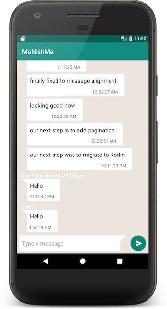

# MaNishMa

MaNishMa is a WhatsApp like chat app based on Firebase Realtime Database. 
The main motivation behind this app is purely for learning purposes. Experimenting with different technologies, techniques and architectures. 

**This project is work in progress, mainly during my free time.**

### Architecture

The project attempts to adhere to the best practices in Android App development.

* MVVM is used as the architecture for the UI in combination with Android Data Binding library
* Each code package encapsulates a specific feature in the app
* Dagger Android is used for dependency injection
* Abstraction - services are abstracted using interfaces so they can be easily changed with Dagger. One example is `FirebaseMessagingService` under `realtimedb` branch, which is replaced by `XmppMessagingService` in other branches.
* Unit testing the model in isolation
* Espresso automated UI testing

### Repository branches

This repository contains several branches. The one which is being actively developed is `realtimedb`.
The other branches are experiments that I've done with different architectures and technologies, such as:
* MVP vs MVVM
* Java vs Kotlin
* Firebase Realtime Database vs XMPP

etc.

### Build

You'll need Android Studio 3 beta 2 at the minimum to run it. You'll also need to attach your own `google-services.json` file from your Firebase project.

### License

Copyright 2017 Nimrod Dayan

   Licensed under the Apache License, Version 2.0 (the "License");
   you may not use this file except in compliance with the License.
   You may obtain a copy of the License at

       http://www.apache.org/licenses/LICENSE-2.0

   Unless required by applicable law or agreed to in writing, software
   distributed under the License is distributed on an "AS IS" BASIS,
   WITHOUT WARRANTIES OR CONDITIONS OF ANY KIND, either express or implied.
   See the License for the specific language governing permissions and
   limitations under the License.
